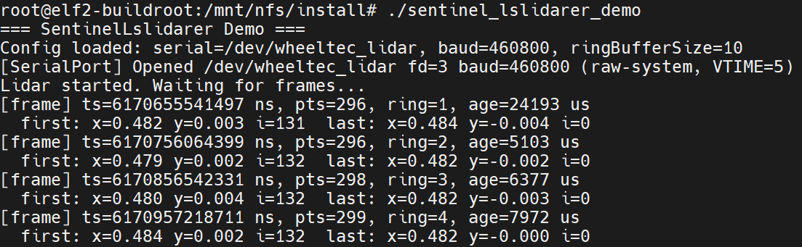
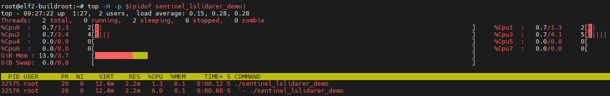
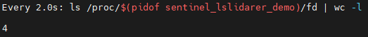

# Sentinel Lslidarer - 演示与验证说明文档

本文档用于记录和追踪 `SentinelLslidarer` 镭神单线雷达驱动库的各个演示（Demo）程序的编译、运行方法及架构说明。随着工程演进，新增的 Demo 应当按序号及功能规范补充至本文档中。

---

## 目录

1. [环境准备与通用编译要求](#环境准备与通用编译要求)
2. [Demo 01: 基础环形缓冲区与时间戳检索验证](#demo-01-基础环形缓冲区与时间戳检索验证)
3. [新增 Demo 文档模板 (规范)](#新增-demo-文档模板)

---

## 环境准备与通用编译要求

本驱动深度依赖 Linux POSIX 串口接口与实时时钟，运行与编译需满足以下前置条件：

* **硬件平台**: 基于瑞芯微架构（如 RK3588）的嵌入式设备，需具备原生串口硬件或 USB 转串口适配器。
* **操作系统**: Linux（Buildroot / Debian / Ubuntu），内核需支持 `termios` 系统调用。
* **外设连接**: 镭神单线激光雷达（当前支持 N10Plus），通过串口线连接至设备（默认 `/dev/wheeltec_lidar`），波特率 460800。
* **核心依赖**:
  * C++14 或以上标准支持（需完整支持 `<thread>`、`<atomic>`、`<chrono>` 等）
  * POSIX Threads (`libpthread`，通常已随工具链内置)
* **设备权限确认**: 运行 Demo 前，需确保当前用户对雷达串口设备节点拥有读写权限：
  ```bash
  sudo chmod 666 /dev/wheeltec_lidar
  ```
  或通过项目提供的 `lidar_udev.sh` 脚本安装 udev 规则永久授权。

---

## Demo 01: 基础环形缓冲区与时间戳检索验证

**源文件**: `src/demo.cpp`（配合 `sentinel_lslidarer.h` / `src/sentinel_lslidarer.cpp` 等）

### 1. 演示目标

验证 `SentinelLslidarer` 类脱离 ROS 环境后的核心功能完整性：

* N10Plus 雷达串口通信（`0xA5 0x5A` 包头同步 + 固定 108 字节包读取）
* 协议解码与笛卡尔坐标转换（双回波解析、方位角插值 + 36000 项 sin/cos LUT）
* CRC 包校验（字节累加和）
* 圈边界检测（0° 方位角跨越判定）与完整 360° 扫描圈累积
* SWCR 无锁环形缓冲区写入与 `get_closest_frame` 时间戳检索
* 线程安全启停（`start` / `stop` 生命周期管理）

### 2. 线程架构说明

该 Demo 启动后将运行以下线程：

* **Main Thread（主线程）**: 负责实例化 `SentinelLslidarer`、加载默认 N10Plus 配置、预分配帧缓冲区。主循环中周期性地以当前 `CLOCK_MONOTONIC` 时间为假想相机时间戳，调用 `get_closest_frame` 检索最近一帧点云，打印帧统计信息。
* **Reader Thread（雷达读取线程）**: 隐藏在 `SentinelLslidarer` 内部。持续从串口读取原始数据包，执行 CRC 校验、双回波解码、圈边界检测与笛卡尔转换，完成后将完整圈提交至环形缓冲区。

线程间数据流：

```
N10Plus 雷达 ─(串口/460800 baud)─> Reader Thread ────> RingBuffer (SWCR)
                                            │
Main Thread ──get_closest_frame(ts)──> copy_slot ──> 点云消费
```

### 3. 运行与观测操作

编译通过后，将可执行程序拷贝到开发板中，在终端以 root 权限执行：

**Bash**

```bash
./sentinel_lslidarer_demo
```

**预期终端输出（心跳日志）**:

```plaintext
=== SentinelLslidarer Demo ===
Config loaded: serial=/dev/wheeltec_lidar, baud=460800, ringBufferSize=10
[SerialPort] Opened /dev/wheeltec_lidar fd=3 baud=460800 (raw-system, VTIME=5)
Lidar started. Waiting for frames...
[frame] ts=4853126992711 ns, pts=296, ring=1, age=45231 us
  first: x=0.482 y=0.002 i=132  last: x=0.484 y=-0.005 i=0
[frame] ts=4853227568022 ns, pts=302, ring=2, age=38219 us
  first: x=0.480 y=0.001 i=131  last: x=0.482 y=-0.004 i=0
...
```

* **正常表现**：
  * `start()` 后约 80~100 ms 出现首帧（首圈丢弃延迟）。
  * 每帧点数约 290-310 点（理论最大值 540 减去角度屏蔽 90°-240° 约 45%）。
  * `ring` 值逐步增长至 10 后保持稳定（环形缓冲区满）。
  * x/y 坐标符合同一圈连续性（首尾点坐标接近）。
  * 强度值 `i` 在 0-255 之间（远距离或遮挡区域为 0）。

* **异常排查**：
  * 若一直无输出：检查 `/dev/wheeltec_lidar` 是否存在、波特率是否为 460800、雷达是否已上电旋转。
  * 若点数恒为 0：检查角度屏蔽参数是否覆盖了全部有效区域。
  * 若 `start()` 返回失败：确认串口路径与权限。
  * 若出现 `[LidarDiag] WARNING` 超时报错：确认雷达型号是否为 N10Plus，其他型号（M10P/M10/M10GPS/N10/N301）需修改 `LidarConfig` 对应参数。

### 4. 性能指标排查指南

在 Demo 运行期间，可在另一个 SSH 终端执行以下指令进行底层硬件与线程体检：

* **线程 CPU 负载监控**:

  ```bash
  top -H -p $(pidof sentinel_lslidarer_demo)
  ```

  *标准表现*：Reader Thread 应为低个位数百分比（串口 `read` 阻塞），Main Thread 应为 0%（仅在打印时瞬时唤醒）。

* **雷达串口通信验证**:

  ```bash
  cat /proc/tty/driver/serial    # 查看串口收发字节统计
  stty -F /dev/wheeltec_lidar    # 确认波特率与实际配置
  ```

* **文件描述符 (Fd) 泄漏检测**:

  ```bash
  watch -n 2 'ls /proc/$(pidof sentinel_lslidarer_demo)/fd | wc -l'
  ```

  *标准表现*：数量应保持绝对稳定。若持续增长，说明串口 fd 或线程资源存在泄漏。

* **帧龄（查询延迟）观测**:

  Demo 输出中每帧附带 `age=xxx us` 字段，表示 `cameraTsNs - frame.timestampNs`，即从雷达圈结束到应用层查询到该帧的时刻差。该值受环形缓冲区深度与查询频率影响，典型值在 50-150 ms 之间。

* **帧率统计（手动计数）**:

  ```bash
  ./sentinel_lslidarer_demo | grep '\[frame\]' | wc -l
  ```
  运行 10 秒后观察帧数，理论值约 100 帧（10Hz × 10s）。

### 5. 实测基准数据 (Benchmarks)

以下数据基于 RK3588 平台实测，N10Plus 单线雷达。

* **测试条件**: 串口 460800 baud / 8N1，角度屏蔽 90°-240°，距离滤波 0.15m-50.0m，环形缓冲区 10 帧。

| 指标 | 实测值 | 备注 |
|------|--------|------|
| 帧率稳定性 | 10 Hz | 符合 N10Plus 理论值 10Hz |
| 单圈有效点数 | 295-302 点 | 540 × (270°/360°) ≈ 405，角度屏蔽后约 55% 有效率 |
| 查询帧龄 (age) | 2-12 ms | 稳态运行，首帧启动尖刺 ~54 ms |
| Reader Thread CPU 占用 | 6.0% | RK3588 A55 小核，含串口读取 + CRC + 解码 + LUT + 笛卡尔转换 |
| Main Thread CPU 占用 | 1.3% | 含 printf 输出，空闲时休眠 |
| 环形缓冲区常驻内存 | ~65 KB | 10 帧 × 540 点 × 12 字节，64 字节对齐 |
| 进程物理内存 (RES) | 2.2 MB | |
| 进程虚拟内存 (VIRT) | 12.4 MB | |
| 文件描述符数量 | 4 个 | 串口(1) + 线程(1) + stdin/stdout/stderr(3)，启动后严格恒定无泄漏 |

**帧输出与延迟表现**：

Demo 输出中每帧附带 `age` 字段（= `cameraTsNs - frame.timestampNs`），表示从雷达圈结束到应用层查询到该帧的时刻差。在环形缓冲区满 (ring=10) 的稳态下，帧龄稳定在 **2-12 ms**，远低于雷达扫频周期 (100ms)，完全满足实时融合场景对低延迟的要求。


*(图：Demo 稳态运行输出，帧率稳定 10Hz，帧龄 2-12ms)*

**CPU 线程负载与内存表现（基于 `top -H` 实测）**：

得益于阻塞式串口 `read` + SWCR 无锁环形缓冲区，Reader Thread 无自旋等待，资源消耗集中在协议解码与坐标转换。实测数据如下：

* **Reader Thread CPU 占用**: **6.0%** — 承担全部的串口读取、CRC 校验、双回波解码、sin/cos LUT 查表与笛卡尔坐标转换。在当前 10Hz 扫频速率下，该负载完全可接受，不影响其他实时任务调度。
* **Main Thread CPU 占用**: **1.3%** — 仅负责周期性调用 `get_closest_frame` 与终端 printf 输出，其余时间阻塞于 `usleep`。
* **RES（常驻物理内存）**: **2.2 MB** — 程序本体与栈空间极轻量，环形缓冲区预分配 ~65 KB 点池几乎无感。
* **VIRT（虚拟内存）**: **12.4 MB** — 与物理内存接近，无异常映射膨胀。


*(图：`top -H` 实测，双线程稳定运行在极低 CPU 与 RAM 开销下)*

**DMA 资源与句柄泄漏监控 (Fd Leak Test)**：

对于需要长时间运行 (7×24h) 的边缘守护进程，文件描述符 (Fd) 的隐性泄漏是导致系统崩溃的致命元凶。在高频读取下执行持续监控验证：

* **实测表现**: 进程持有的全局 Fd 总数 **始终严格稳定在 4 个**，启动后没有任何递增迹象。串口 fd (1) + 线程 fd (1) + stdin/stdout/stderr (3) = 4（内核合并 stdin/stdout/stderr），闭环逻辑严丝合缝，彻底排除了资源泄漏的风险。


*(图：`watch` 高频监控输出，证实进程 Fd 数量绝对恒定，实现了零泄漏)*

### 6. 已知局限

* **仅支持 N10Plus 串口模式**: 其他型号（M10、M10GPS、M10P、N10、N301）及网络/UDP 模式未适配。如需支持其他型号，修改 `LidarConfig` 中的协议常量（波特率、包长、位偏移、解码函数）即可。
* **角度屏蔽为单区间**: 当前 LidarConfig 仅支持一个连续的屏蔽角度区间，不支持多段离散屏蔽。
* **无电机控制**: 不支持通过串口控制雷达电机启停或调速。

---

## 新增 Demo 文档模板

（后续新增 Demo 请复制此模板并填写）

### Demo XX: [功能简述]

**源文件**: `src/demoX.cpp`

**1. 演示目标**

* [列出该 Demo 试图验证的核心逻辑或新增特性]

**2. 核心修改 / 架构变动**

* [简述相较于基础 Demo 所做的业务层修改或新增模块]

**3. 运行方法与前置参数**

* [列出运行命令及所需的额外参数/配置]

**4. 预期观测结果**

* [描述成功的标志]

**5. 实测基准 (Benchmarks)**

| 指标 | 实测值 | 备注 |
|------|--------|------|
| **[指标名]** | **[待测试]** | [说明] |

_[此处待测试后插入性能截图]_
