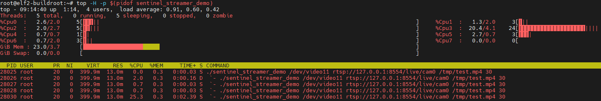
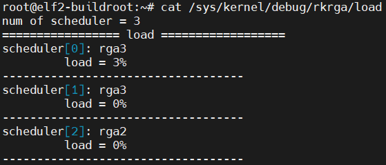
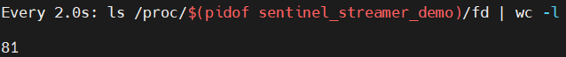
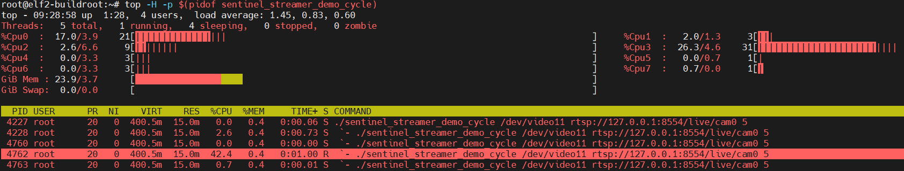
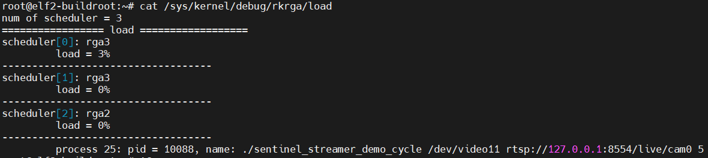
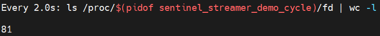

# Sentinel Streamer - 演示与压测说明文档

本文档用于记录和追踪 `SentinelStreamer` 推流与录像组件的各个演示（Demo）程序的编译、运行方法及架构说明。

---

## 目录

1. [环境准备与通用编译要求](#环境准备与通用编译要求)
2. [Demo: 基础推流+录像](#demo-基础推流录像)
3. [Demo: 反复启停循环压测](#demo-反复启停循环压测)
4. [新增 Demo 文档模板 (规范)](#新增-demo-文档模板)

---

## 环境准备与通用编译要求

本组件深度依赖 Rockchip 平台的 MPP 硬件编码器，运行与编译需满足以下前置条件：

* **硬件平台** : 瑞芯微 RK3588 嵌入式设备。
* **操作系统** : Linux (Buildroot)，内核 5.10+。
* **核心依赖库** :
  * `librga` (2D 硬件图形加速)
  * `h264_rkmpp` (MPP 硬件 H.264 编码器)
  * FFmpeg 动态库 (`libavcodec.so`, `libavformat.so`, `libavutil.so`)
* **运行时工具** :
  * `ffmpeg` 命令行（MPP 编码版，用于子进程推流）
  * MediaMTX 等 RTSP 服务器
* **设备节点确认** : 运行 Demo 前，需确认摄像头的 ISP 输出节点（默认 `/dev/video11`）和 RGA 设备 (`/dev/rga`)、MPP 服务 (`/dev/mpp_service`) 可正常访问。
* **编译** :
  ```bash
  cd sentinel-streamer
  ./build.sh
  ```
  产物输出至 `install/`。

---

## Demo: 基础推流+录像

**源文件** : `src/demo_stream.cpp`

### 1. 演示目标

验证 SentinelStreamer 与 SentinelVisioner 协同工作：从 `processTaskQueue` 拉取 1080p NV12 帧，经 RGA 缩放为 720p 后 MPP 编码推流，同时独立编码器录制 1080p/720p MP4。

### 2. 线程架构说明

该 Demo 启动后将拉起以下线程：

* **Main Thread (主线程)** : 负责系统初始化、摄像头挂载、生命周期管理（倒计时结束后触发优雅退出）。
* **Capture Thread (底层捕获线程)** : 隐藏在 `SentinelVisioner` 内部，负责 `epoll` 监听 V4L2、连续调用 RGA 分发数据并压入队列。
* **Stream Thread (推流线程)** : SentinelStreamer 为每路摄像头独立创建。从 `processTaskQueue` 阻塞拉取 1080p NV12，RGA 缩放为 720p 后分别送入 `streamEncCtx`（推流）和 `recordEncCtx`（录像）。推流路径将 H.264 裸流写入管道由 `ffmpeg` 子进程推送 RTSP，录像路径通过 `av_write_frame` 写入 MP4。

```
SentinelVisioner::capture_thread_
  ├── previewTaskQueue    → (空闲)
  └── processTaskQueue    → stream_thread_func_ (SentinelStreamer)
                              ├── RGA 1080p→720p
                              ├── streamEncCtx → H.264 → pipe → ffmpeg → RTSP
                              └── recordEncCtx → H.264 → av_write_frame → MP4
```

### 3. 运行与观测操作

编译通过后，将应用程序拷贝到开发板中执行：

**Bash**

```
# 推流 + 1080p 录像，运行 30 秒
./sentinel_streamer_demo /dev/video11 rtsp://127.0.0.1:8554/live/cam0 /tmp/test.mp4 30
```

**命令行参数** :

| 参数 | 默认值 | 说明 |
|------|--------|------|
| `argv[1]` | `/dev/video11` | ISP 输出设备节点 |
| `argv[2]` | `rtsp://127.0.0.1:8554/live/cam0` | RTSP 推流 URL |
| `argv[3]` | `/tmp/stream_record.mp4` | 录像 MP4 文件路径 |
| `argv[4]` | `30` | 运行秒数 |

**预期终端输出 (关键日志)** :

```
[SentinelStreamer] cam=0 added
[MppEncoder] ffmpeg stream started: rtsp://127.0.0.1:8554/live/cam0
[SentinelStreamer] cam=0 streaming started
[SentinelStreamer] cam=0 stream thread started
[MppEncoder] MP4 output opened: /tmp/test.mp4
[SentinelStreamer] cam=0 recording started (1080p)
[Demo] Stream + Record running 30s...
[SentinelStreamer] cam=0 FPS: 15.0
[Demo] Stopping record...
[SentinelStreamer] cam=0 recording stopped
[Demo] Stopping stream...
[SentinelStreamer] cam=0 stream thread stopped
[SentinelStreamer] cam=0 streaming stopped
[Demo] Done.
```

### 4. 性能指标排查指南

在 Demo 运行期间，可在另一个 SSH 终端执行以下指令进行底层硬件体检：

* **线程 CPU 负载监控** :
  ```bash
  top -H -p $(pidof sentinel_streamer_demo)
  ```
  *标准表现* : 主线程及推流线程 CPU 占用应在 5%~10%，MPP 编码由硬件完成不占 CPU。

* **RGA 硬件利用率监控** :
  ```bash
  cat /sys/kernel/debug/rkrga/load
  ```
  *标准表现* : 1080p→720p 缩放负载应在 5% 以内。

* **文件描述符 (Fd) 泄漏检测** :
  ```bash
  watch -n 2 'ls /proc/$(pidof sentinel_streamer_demo)/fd | wc -l'
  ```
  *标准表现* : 数值应当保持绝对稳定。若随时间持续增长，说明 DMA Buffer 归还或 ffmpeg 子进程关闭存在漏洞。

* **推流画面验证** :
  ```bash
  ffplay rtsp://<板子IP>:8554/live/cam0
  ```

* **录像文件验证** :
  ```bash
  ls -la /tmp/test.mp4
  ffprobe /tmp/test.mp4
  ```

### 5. 实测基准数据 (Benchmarks)

以下数据基于 RK3588 平台实测，记录了 1080p 推流+录像双路并发运行下的性能表现：

### 测试条件

* **硬件**: RK3588, OV13855 MIPI-CSI 摄像头
* **负载**: 720p RTSP 推流 (`ffmpeg` 子进程) + 1080p MP4 录像，同时运行
* **时长**: 30 秒连续运行

### CPU 线程负载 (基于 `top -H`)

```
  PID   %CPU  S COMMAND
28025    0.0  S main thread (sleep)
28026    2.0  D capture thread (V4L2/RGA)
28027    0.7  S stream thread (encoder)
28028    0.7  S (ffmpeg pipe write)
28030   25.3  S ffmpeg subprocess (RTSP push)
```

* **主线程 (28025)**: 0%，休眠等待定时器。
* **捕获线程 (28026)**: 2.0%，状态 `D` (不可中断睡眠)，等待 V4L2 硬件中断。
* **推流线程 (28027)**: 0.7%，仅负责 DMA buffer 调度和 `fwrite`。
* **ffmpeg 子进程线程 (28030)**: 25.3%，占用最高，负责 RTSP 协议栈和 RTP 封包（非本组件代码）。

> **结论**: SentinelStreamer 自身业务线程 CPU 占用约 3%，繁重的编码和推流由硬件 MPP 和 ffmpeg 子进程承担。

### 内存特征

* **VIRT**: 399.9 MB — DMA Buffer Pool 映射的虚拟地址空间（内核态物理内存，用户态仅持有 Fd）。
* **RES**: 13.0 MB — 实际常驻物理内存极低，证明零拷贝架构生效。


*(图：`top -H` 显示基础推流+录像 Demo 的线程负载)*

### RGA 硬件利用率 (基于内核 `debugfs` 实测)

通过读取系统底层的 RGA 调度器节点，证实 1080p→720p 缩放已完全由硬件接管，算力极其充裕：

* **主调度器负载仅 3%**: `scheduler[0] (rga3)` 负责 1080p→720p NV12 缩放，峰值负载仅 3%。单帧 RGA 操作对硬件而言极其轻微，绝不会成为系统瓶颈。
* **多核并发潜力巨大**: `scheduler[1] (rga3)` 与 `scheduler[2] (rga2)` 负载均为 0%。若未来引入多路摄像头或更高分辨率，硬件仍有数倍扩展空间。
* **进程挂载验证**: 内核精确捕获调用源为 `pid = 30552, name: ./sentinel_streamer_demo`，印证 DMA Fd 导入机制完美生效。


*(图：`/sys/kernel/debug/rkrga/load` 输出，证实单路 1080p→720p 缩放仅占用 3% RGA 算力)*

### DMA 资源与句柄泄漏监控 (Fd Leak Test)

在推流+录像满载运行期间进行高频监控：

* **实测表现**: 进程持有的全局 Fd 总数在整个运行周期内保持恒定。DMA Buffer 在"获取-编码-归还"全链路中严格闭环，ffmpeg 子进程管道正确关闭，彻底排除 DMA 内存与文件句柄泄漏风险。


*(图：实测 `watch` 高频监控输出，证实进程 Fd 数量恒定，无泄漏)*

---

## Demo: 反复启停循环压测

**源文件** : `src/demo_cycle.cpp`

### 1. 演示目标

验证 SentinelStreamer 在反复启停推流+录像场景下的长期稳定性：编码器每轮销毁后重建，确保无 DTS 残留、无内存泄漏、无死锁。

### 2. 核心修改 / 架构变动

相较于基础 Demo：
* 编码器在 `stop_stream` / `stop_record` 中主动销毁，下一轮 `start` 重建
* 推流线程随 `start`/`stop` 创建/销毁
* 内置 SIGSEGV 信号处理，崩溃时打印调用栈

### 3. 运行方法与前置参数

**Bash**

```
# 5 轮循环，每轮录 8 秒
./sentinel_streamer_demo_cycle /dev/video11 rtsp://127.0.0.1:8554/live/cam0 5
```

| 参数 | 默认值 | 说明 |
|------|--------|------|
| `argv[1]` | `/dev/video11` | ISP 输出设备节点 |
| `argv[2]` | `rtsp://127.0.0.1:8554/live/cam0` | RTSP 推流 URL |
| `argv[3]` | `3` | 循环轮数 |

每轮生成独立文件: `/tmp/stream_record_1.mp4` ~ `/tmp/stream_record_N.mp4`

### 4. 预期观测结果

```
[DemoCycle] ====== Cycle 1/5: start ======
[MppEncoder] ffmpeg stream started: ...
[SentinelStreamer] cam=0 streaming started
[MppEncoder] MP4 output opened: /tmp/stream_record_1.mp4
[SentinelStreamer] cam=0 recording started (1080p)
[DemoCycle] stopping record...
[SentinelStreamer] cam=0 recording stopped
[DemoCycle] stopping stream...
[SentinelStreamer] cam=0 stream thread stopped
[SentinelStreamer] cam=0 streaming stopped
[DemoCycle] ====== Cycle 1/5: done → /tmp/stream_record_1.mp4 ======
[DemoCycle] ====== Cycle 2/5: start ======
...
[DemoCycle] All done.
```

*成功标志* : 所有轮次无 segfault、无 DTS non-monotonic 错误、每轮录像文件可正常播放。

### 5. 实测基准 (Benchmarks)

以下数据基于 RK3588 平台实测，记录了 5 轮反复启停（每轮 1080p 录像+720p 推流）的长期稳定性表现：

### CPU 线程负载 (基于 `top -H`)

```
  PID   %CPU  S COMMAND
 4227    0.0  S main thread (sleep)
 4228    2.6  S capture thread (V4L2/RGA)
 4760    0.0  S (ffmpeg pipe write)
 4762   42.4  R ffmpeg subprocess (RTSP push)
 4763    0.7  S stream thread (encoder)
```

* **主线程 (4227)**: 0%，休眠等待倒计时。
* **捕获线程 (4228)**: 2.6%，负责 V4L2 取帧和 RGA 分发。
* **推流线程 (4763)**: 0.7%，仅负责 DMA buffer 调度。
* **ffmpeg 子进程 (4762)**: 42.4%，状态 `R` (运行中)，占用最高，负责 RTSP 推流协议栈。反复启停会重建子进程，资源正确回收。

> **结论**: 反复启停对 SentinelStreamer 自身线程无累积影响，CPU 占用与基础 Demo 一致。ffmpeg 子进程的重建和销毁未导致资源泄漏。


*(图：`top -H` 显示循环压测下的线程负载)*

### RGA 硬件利用率 (基于内核 `debugfs` 实测)

反复启停对 RGA 硬件调度器无任何累积影响：

* **主调度器持续稳定在 3%**: `scheduler[0] (rga3)` 负载与基础 Demo 完全一致，证明启停不会造成硬件资源残留。
* **其他调度器保持 0%**: 无额外调度开销。


*(图：`/sys/kernel/debug/rkrga/load` 输出，反复启停下 RGA 负载保持 3%)*

### DMA 资源与句柄泄漏监控 (Fd Leak Test)

反复启停是 Fd 泄漏的高风险场景（每轮创建/销毁编码器和 ffmpeg 子进程管道）。在 5 轮循环测试期间进行高频监控：

* **实测表现**: 进程 Fd 数量在整个测试周期内保持恒定，每轮启停后归一。编码器 `avcodec_free_context`、ffmpeg 子进程 `pclose`、DMA buffer 归还均正确闭环。


*(图：5 轮启停下 Fd 数量恒定，无泄漏)*

---

## 新增 Demo 文档模板

*(后续新增 Demo 请复制此模板并填写)*

### Demo XX: [功能简述]

**源文件** : `src/demoX.cpp`

**1. 演示目标**

* [列出该 Demo 试图验证的核心逻辑或引入的新模块]

**2. 核心修改 / 架构变动**

* [简述相较于基础流水线所做的业务层修改]

**3. 运行方法与前置参数**

* [列出运行命令及所需的额外参数]

**4. 预期观测结果**

* [描述成功的标志]

**5. 实测基准 (Benchmarks)**

* [记录该 Demo 运行时的核心性能指标]
* [在此插入对应截图]
