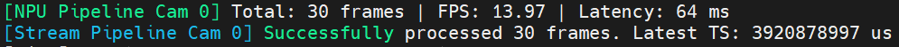
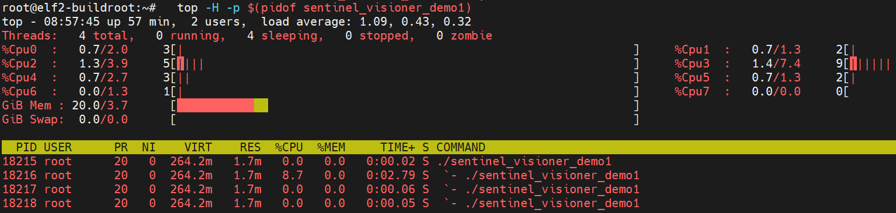
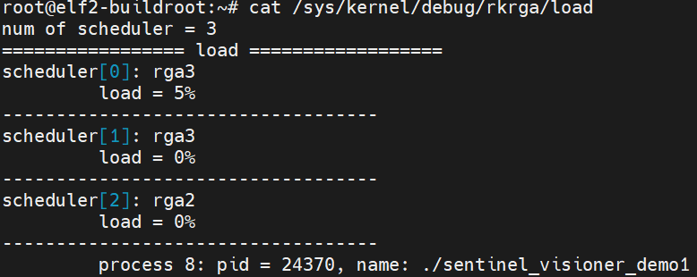

# Sentinel Visioner - 演示与压测说明文档

本文档用于记录和追踪 `SentinelVisioner` 核心视觉流水线的各个演示（Demo）程序的编译、运行方法及架构说明。随着工程演进，新增的 Demo 应当按序号及功能规范补充至本文档中。

---

## 目录

1. [环境准备与通用编译要求](https://www.google.com/search?q=%23%E7%8E%AF%E5%A2%83%E5%87%86%E5%A4%87%E4%B8%8E%E9%80%9A%E7%94%A8%E7%BC%96%E8%AF%91%E8%A6%81%E6%B1%82&authuser=1)
2. [Demo 01: 基础零拷贝流水线与多线程压测](https://www.google.com/search?q=%23demo-01-%E5%9F%BA%E7%A1%80%E9%9B%B6%E6%8B%B7%E8%B4%9D%E6%B5%81%E6%B0%B4%E7%BA%BF%E4%B8%8E%E5%A4%9A%E7%BA%BF%E7%A8%8B%E5%8E%8B%E6%B5%8B&authuser=1)
3. [新增 Demo 文档模板 (规范)](https://www.google.com/search?q=%23%E6%96%B0%E5%A2%9E-demo-%E6%96%87%E6%A1%A3%E6%A8%A1%E6%9D%BF&authuser=1)

---

## 环境准备与通用编译要求

本套流水线深度依赖 Rockchip 平台的硬件加速特性，运行与编译需满足以下前置条件：

* **硬件平台** : 基于瑞芯微架构（如 RK3568 / RK3588）的嵌入式设备。
* **操作系统** : Linux (Buildroot / Debian / Ubuntu)，内核需开启 V4L2 框架。
* **核心依赖库** :
* `librga` (2D 硬件图形加速)
* C++14 或以上标准支持（需完整支持 `<thread>`, `<atomic>`, `<chrono>` 等）
* **设备节点确认** : 运行 Demo 前，需确认物理摄像头的 ISP 输出节点（默认配置为 `/dev/video11`，可通过 `media-ctl` 排查）。

---

## Demo 01: 基础零拷贝流水线与多线程压测

 **源文件** : `src/demo1.cpp` (配合 `sentinel-visioner.cpp/h`)

### 1. 演示目标

验证基于 DMA Buffer Pool 的“一转多”零拷贝（Zero-Copy）架构。测试 V4L2 图像采集、RGA 硬件缩放/格式转换、以及多消费者线程安全出入队的稳定性与性能损耗。

### 2. 线程架构说明

该 Demo 启动后将拉起以下线程，实现互不干扰的异步流水线：

* **Main Thread (主线程)** : 负责系统初始化、摄像头挂载、生命周期管理（休眠 60 秒后触发优雅退出）。
* **Capture Thread (底层捕获线程)** : 隐藏在 `SentinelVisioner` 内部，负责 `epoll` 监听、出队 NV12 图像、连续调用 RGA 硬件进行数据分发，完成后立即将 Buffer 归还内核。
* **NPU & OSD Consumer (推理/渲染消费线程)** : 阻塞获取 RGB888 小图与 720P OSD 底图。负责端到端延迟测算，预留 YOLO 模型推理与目标框绘制接口。
* **Stream Consumer (推流消费线程)** : 阻塞获取原始 1080P NV12 图像，模拟将纯净画面送入 MPP 硬件编码器进行推流或视频落盘。

### 3. 运行与观测操作

编译通过后，将应用程序拷贝到开发板中，在终端以 root 权限执行：

**Bash**

```
./sentinel_visioner_demo1
```

 **预期终端输出 (心跳日志)** :

系统将静默处理数据，每隔 30 帧（约 1 秒）打印一次性能报告。

**Plaintext**

```
[NPU Thread] Started for Camera 0 - Waiting for data...
[Stream Thread] Started for Camera 0 - Waiting for data...
Current FPS set to: 30
Camera 0 (/dev/video11) added successfully.
[NPU Pipeline Cam 0] Total: 30 frames | FPS: 30.00 | Latency: 3 ms
[Stream Pipeline Cam 0] Successfully processed 30 frames. Latest TS: 12543022134 us
...
```

### 4. 性能指标排查指南

在 Demo 运行期间，可在另一个 SSH 终端执行以下指令进行底层硬件体检：

* **线程 CPU 负载监控** :
  **Bash**

```
  top -H -p $(pidof sentinel_visioner_demo1)
```

   *标准表现* ：捕获线程占用应在 5%~10% 左右，主线程与休眠的消费者线程应为 0%。

* **RGA 硬件利用率监控** :
  **Bash**

```
  cat /sys/kernel/debug/rkrga/load
```

   *标准表现* ：连续 3 次 RGA 调用的硬件负载（Load）应在 5%~10% 之间，证明算力余量充足。

* **文件描述符 (Fd) 泄漏检测** :
  **Bash**

```
  watch -n 2 'ls /proc/$(pidof sentinel_visioner_demo1)/fd | wc -l'
```

   *标准表现* ：数值应当保持绝对稳定。若随时间持续增长，说明 DMA 内存释放逻辑存在漏洞。

**CPU 线程负载与内存表现 (基于 `top -H` 实测)**：
得益于纯硬件 DMA 交互与阻塞式安全队列，C++ 业务线程完全无自旋空转（Spin-lock），系统资源消耗极低。实测数据如下：

### 5. 实测基准数据 (Benchmarks)

以下数据基于 RK3588 平台实测，记录了在双路异步队列满载运行下的流水线性能表现：

* **测试条件**: 1080P NV12 物理视频流输入，双队列并发处理（开启 NPU 专属 640x640 RGB888 缩放分支 + 原图推流分支）。
* **端到端延迟 (Latency)**: **稳定在 64 ms 左右**（该延迟涵盖了 V4L2 硬件捕获、三次 RGA 硬件调度处理及线程间通信开销。实测表明流水线内部周转极速，未产生内存拷贝阻塞）。
* **帧率表现 (FPS)**: **实测均值 13.97 FPS**（注：当前吞吐量受限于物理传感器（Sensor）在测试环境下的默认出帧率或自动曝光（AE）降频策略限制，C++ 零拷贝软件流水线本身尚未触及性能瓶颈，待后续 Sensor 寄存器调优后可解锁更高帧率）。


*(图：实测心跳日志，展现了稳定无波动的延迟与帧率表现)*

**CPU 线程负载与内存表现 (基于 `top -H` 实测)**：
得益于纯硬件 DMA 交互与阻塞式安全队列，C++ 业务线程完全无自旋空转（Spin-lock），系统资源消耗极低。实测数据如下：

* **核心负载极低 (8.7%)**：
  * **捕获与调度线程 (PID 18216)** 是全场唯一有明显活动的线程。它负责 `epoll` 监听、V4L2 驱动出入队以及连续触发 3 次 RGA 硬件调用。即便如此，其单核 CPU 占用峰值也仅为 **8.7%**。这证明了繁重的像素级运算已完全卸载至 RGA 硬件引擎。
* **完美的休眠调度 (0.0%)**：
  * **主控制线程 (PID 18215)** 与两个 **消费者线程 (PID 18217, 18218)** CPU 占用率均为 **0.0%**，且状态均为 `S` (Sleeping)。这证明基于条件变量构建的 `ThreadSafeQueue` 表现完美，消费者在无数据时完全不占用 CPU 资源。
* **零拷贝的内存特征 (VIRT vs RES)**：
  * **RES (常驻物理内存) 仅为 1.7 MB**：C++ 程序本体及其业务逻辑极其轻量。
  * **VIRT (虚拟内存) 达到 264.2 MB**：这正是 DMA Buffer Pool 架构的标志。庞大的 1080P/720P 图像池（分配在内核空间的连续物理内存中）仅仅通过 `mmap` 映射到了用户态虚拟地址空间。整个流水线没有发生任何 `memcpy`，物理内存消耗被严格控制。


*(图：`top -H` 显示多线程流水线在极低 CPU 与 RAM 开销下稳定运行)*

**RGA 硬件利用率表现 (基于内核 `debugfs` 实测)**：
通过读取系统底层的 RGA 调度器节点，证实了繁重的图像缩放与格式转换已完全由专用硬件接管，且算力余量极其充裕。实测数据如下：

* **极低的单核负载 (5%)**：
  * 尽管单路流水线在每一帧内连续触发了 3 次硬件级操作（NV12 -> 640x640 RGB888、1080P -> 720P NV12 缩放、1080P 原尺寸拷贝），主调度器 `scheduler[0] (rga3)` 的峰值负载仅占 **5%**。这表明当前的图像预处理对硬件而言极其轻松，单帧硬件耗时极短，绝不会成为系统瓶颈。
* **巨大的多核并发潜力 (0%)**：
  * 系统集成的另外两个调度核心 `scheduler[1] (rga3)` 与 `scheduler[2] (rga2)` 当前负载均为 **0%**。这意味着若未来引入多路摄像头并行输入，或升级为 RGA 异步 API，底层硬件仍具备数倍的算力扩展空间。
* **精准的进程挂载验证**：
  * 内核精确捕获到调用源为 `pid = 24370, name: ./sentinel_visioner_demo1`。这从底层印证了 C++ 代码中的 DMA Fd 导入机制完美生效，真正实现了“CPU 仅负责发号施令，独立硬件执行像素搬运”的设计初衷。


*(图：`/sys/kernel/debug/rkrga/load` 节点输出，证实单路 1080P 处理仅占用极少量 RGA 算力)*

**DMA 资源与句柄泄漏监控 (Fd Leak Test)**：
对于需要长时间运行（7x24h）的边缘视觉守护进程，DMA 文件描述符 (Fd) 的隐性泄漏是导致系统最终崩溃（Too many open files）的致命元凶。我们在满载压测期间对其执行了高频监控验证：

* **实测表现** ：在流水线全速运转、动态周转上万帧图像后，进程持有的全局 Fd 总数 **始终严格稳定在 38 个** ，没有任何缓慢递增的迹象。这从 Linux 内核层面证实了 `DmaBufferPool` 在“分配-映射-消费-释放”整个生命周期中的闭环逻辑严丝合缝，彻底排除了 DMA 内存与文件句柄泄漏的风险。


*(图：实测 `watch` 高频监控输出，证实进程 Fd 数量绝对恒定，实现了极其安全的零泄漏)*

### 6. 当前瓶颈与进阶调优指南 (Optimization & Tuning)

当前的零拷贝软件流水线已在资源消耗上达到了极高的效率，但结合实际工业落地场景，本 Demo 仍有以下几个明确的进阶调优方向：

* **传感器帧率解锁 (Sensor AE Tuning)**：
  * **现状**：软件流水线耗时极短（< 5ms），但实测吞吐量仅约为 15 FPS。
  * **优化方案**：该瓶颈系物理 Sensor（如 OV13855）在暗光环境下的 Auto-Exposure（自动曝光）策略导致。后续需通过修改 `rkaiq` 算法服务的 IQ 调教文件（`.xml`），或通过 V4L2/Media-ctl 接口强行锁定曝光时间（Manual Exposure），以在暗光下强制解锁 30/60 FPS。
* **设备节点动态解析 (Dynamic Topology Parsing)**：
  * **现状**：Demo 中硬编码了 ISP 输出节点为 `/dev/video11`。在设备重启或多摄接入时，该节点序号可能会发生漂移。
  * **优化方案**：后续需引入 Media Controller API（或封装 `media-ctl` 指令），通过解析 `/dev/mediaX` 拓扑图，根据 Sensor 名字自动寻找并绑定对应的 ISP 输出 `video` 节点，提高程序的即插即用鲁棒性。
* **安全队列的优雅唤醒 (Graceful Thread Unblocking)**：
  * **现状**：在系统 Shut down 阶段，当前依赖推入空指针（Dummy Task）或超时机制来唤醒阻塞在 `wait_get_xxx` 上的消费者线程。
  * **优化方案**：升级 `ThreadSafeQueue` 组件，为其加入 `abort()` 或 `unblock_all()` 方法。在触发退出信号时，直接通过 `std::condition_variable::notify_all()` 唤醒所有等待线程，实现更加干净利落的退出与资源回收。
* **RGA 异步调度 (Asynchronous Hardware Dispatch)**：
  * **现状**：当前 RGA 使用的是 `improcess/imcopy` 同步阻塞接口，单核负载仅 5%。
  * **优化方案**：若未来扩展为 4 路/8 路多摄拼接场景，可将其替换为 `improcess_async` 异步接口，激活芯片内部闲置的多个 RGA 调度核心（如 `rga2`, `rga3_1`），实现极致的多核硬件并发。

---

## 新增 Demo 文档模板

*(后续新增 Demo 请复制此模板并填写)*

### Demo XX: [功能简述]

 **源文件** : `src/demoX.cpp`

**1. 演示目标**

* [列出该 Demo 试图验证的核心逻辑或引入的新模块，如：接入 rknn-toolkit2 进行实时目标检测]

**2. 核心修改 / 架构变动**

* [简述相较于基础流水线所做的业务层修改]

**3. 运行方法与前置参数**

* [列出运行命令及所需的额外参数/模型文件，如：`./demoX ./model/yolov8.rknn`]

**4. 预期观测结果**

* [描述成功的标志，如：生成带有 bounding box 的本地 mp4 文件，或控制台输出目标类别坐标]

**5. 实测基准 (Benchmarks)** 

* [记录该 Demo 运行时的核心性能指标，如：CPU占用率、NPU推理耗时、内存增长情况]
* [在此插入对应的 `htop` 或 RGA 负载截图以作证明]
