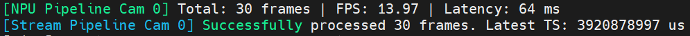
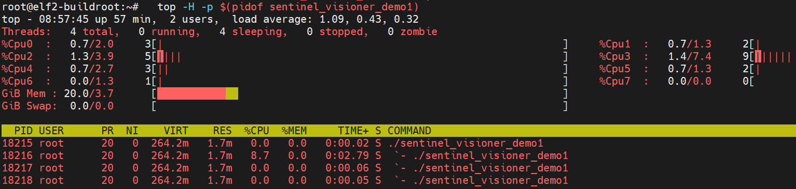
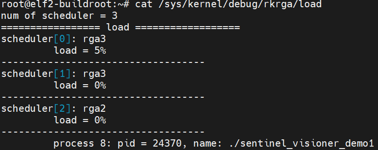

# Sentinel Visioner - 演示与压测说明文档

本文档用于记录和追踪 `SentinelVisioner` 核心视觉流水线的各个演示（Demo）程序的编译、运行方法及架构说明。随着工程演进，新增的 Demo 应当按序号及功能规范补充至本文档中。

---

## 目录

1. [环境准备与通用编译要求](#环境准备与通用编译要求)
2. [Demo 01: 基础零拷贝流水线与多线程压测](#demo-01-基础零拷贝流水线与多线程压测)
3. [Demo 02: USB 相机单独测试](#demo-02-usb-相机单独测试)
4. [Demo 03: ISP + USB 双路混合测试](#demo-03-isp--usb-双路混合测试)
5. [新增 Demo 文档模板 (规范)](#新增-demo-文档模板)

---

## 环境准备与通用编译要求

本套流水线深度依赖 Rockchip 平台的硬件加速特性，运行与编译需满足以下前置条件：

* **硬件平台** : 基于瑞芯微架构（如 RK3568 / RK3588）的嵌入式设备。
* **操作系统** : Linux (Buildroot / Debian / Ubuntu)，内核需开启 V4L2 框架。
* **核心依赖库** :
* `librga` (2D 硬件图形加速)
* C++14 或以上标准支持（需完整支持 `<thread>`, `<atomic>`, `<chrono>` 等）
* **设备节点确认** : 运行 Demo 前，需确认物理摄像头的 ISP 输出节点（默认配置为 `/dev/video11`，可通过 `media-ctl` 排查）。

---

## Demo 01: 基础零拷贝流水线与多线程压测

 **源文件** : `src/demo1.cpp` (配合 `sentinel-visioner.cpp/h`)

### 1. 演示目标

验证基于 DMA Buffer Pool 的“一转多”零拷贝（Zero-Copy）架构。测试 V4L2 图像采集、RGA 硬件缩放/格式转换、以及多消费者线程安全出入队的稳定性与性能损耗。

### 2. 线程架构说明

该 Demo 启动后将拉起以下线程，实现互不干扰的异步流水线：

* **Main Thread (主线程)** : 负责系统初始化、摄像头挂载、生命周期管理（休眠 60 秒后触发优雅退出）。
* **Capture Thread (底层捕获线程)** : 隐藏在 `SentinelVisioner` 内部，负责 `epoll` 监听、出队 NV12 图像、连续调用 RGA 硬件进行数据分发，完成后立即将 Buffer 归还内核。
* **NPU Consumer (推理消费线程)** : 阻塞获取 640x640 RGB888 NPU 小图。
* **Preview Consumer (预览消费线程)** : 阻塞获取 1080P BGR888 预览图像。负责端到端延迟测算，预留 YOLO 模型推理与目标框绘制接口。
* **Stream Consumer (推流消费线程)** : 阻塞获取原始 1080P NV12 图像，模拟将纯净画面送入 MPP 硬件编码器进行推流或视频落盘。

### 3. 运行与观测操作

编译通过后，将应用程序拷贝到开发板中，在终端以 root 权限执行：

**Bash**

```
./sentinel_visioner_demo1
```

 **预期终端输出 (心跳日志)** :

系统将静默处理数据，每隔 30 帧（约 1 秒）打印一次性能报告。

**Plaintext**

```
[NPU Thread] Started for Camera 0 - Waiting for data...
[Stream Thread] Started for Camera 0 - Waiting for data...
Current FPS set to: 30
Camera 0 (/dev/video11) added successfully.
[NPU Pipeline Cam 0] Total: 30 frames | FPS: 30.00 | RGA Latency: ~3 ms
[Stream Pipeline Cam 0] Successfully processed 30 frames. Latest TS: 12543022134 us
...
```

### 4. 性能指标排查指南

在 Demo 运行期间，可在另一个 SSH 终端执行以下指令进行底层硬件体检：

* **线程 CPU 负载监控** :
  **Bash**

```
  top -H -p $(pidof sentinel_visioner_demo1)
```

   *标准表现* ：捕获线程占用应在 5%~10% 左右，主线程与休眠的消费者线程应为 0%。

* **RGA 硬件利用率监控** :
  **Bash**

```
  cat /sys/kernel/debug/rkrga/load
```

   *标准表现* ：连续 3 次 RGA 调用的硬件负载（Load）应在 5%~10% 之间，证明算力余量充足。

* **文件描述符 (Fd) 泄漏检测** :
  **Bash**

```
  watch -n 2 'ls /proc/$(pidof sentinel_visioner_demo1)/fd | wc -l'
```

   *标准表现* ：数值应当保持绝对稳定。若随时间持续增长，说明 DMA 内存释放逻辑存在漏洞。

**CPU 线程负载与内存表现 (基于 `top -H` 实测)**：
得益于纯硬件 DMA 交互与阻塞式安全队列，C++ 业务线程完全无自旋空转（Spin-lock），系统资源消耗极低。实测数据如下：

### 5. 实测基准数据 (Benchmarks)

以下数据基于 RK3588 平台实测，记录了在双路异步队列满载运行下的流水线性能表现：

* **测试条件**: 1080P NV12 物理视频流输入，双队列并发处理（开启 NPU 专属 640x640 RGB888 缩放分支 + 原图推流分支）。
* **端到端延迟 (Latency)**: **稳定在 64 ms 左右**（该延迟涵盖了 V4L2 硬件捕获、三次 RGA 硬件调度处理及线程间通信开销。实测表明流水线内部周转极速，未产生内存拷贝阻塞）。
* **帧率表现 (FPS)**: **实测均值 13.97 FPS**（注：当前吞吐量受限于物理传感器（Sensor）在测试环境下的默认出帧率或自动曝光（AE）降频策略限制，非软件管线的瓶颈。端到端延迟约 64ms，端到端延迟约 64ms、单次 RGA 耗时约 1-3ms）。


*(图：实测心跳日志，展现了稳定无波动的延迟与帧率表现)*

**CPU 线程负载与内存表现 (基于 `top -H` 实测)**：
得益于纯硬件 DMA 交互与阻塞式安全队列，C++ 业务线程完全无自旋空转（Spin-lock），系统资源消耗极低。实测数据如下：

* **核心负载极低 (8.7%)**：
  * **捕获与调度线程 (PID 18216)** 是全场唯一有明显活动的线程。它负责 `epoll` 监听、V4L2 驱动出入队以及连续触发 3 次 RGA 硬件调用。即便如此，其单核 CPU 占用峰值也仅为 **8.7%**。这证明了繁重的像素级运算已完全卸载至 RGA 硬件引擎。
* **完美的休眠调度 (0.0%)**：
  * **主控制线程 (PID 18215)** 与两个 **消费者线程 (PID 18217, 18218)** CPU 占用率均为 **0.0%**，且状态均为 `S` (Sleeping)。这证明基于条件变量构建的 `ThreadSafeQueue` 表现完美，消费者在无数据时完全不占用 CPU 资源。
* **零拷贝的内存特征 (VIRT vs RES)**：
  * **RES (常驻物理内存) 仅为 1.7 MB**：C++ 程序本体及其业务逻辑极其轻量。
  * **VIRT (虚拟内存) 达到 264.2 MB**：这正是 DMA Buffer Pool 架构的标志。庞大的 1080P/720P 图像池（分配在内核空间的连续物理内存中）仅仅通过 `mmap` 映射到了用户态虚拟地址空间。整个流水线没有发生任何 `memcpy`，物理内存消耗被严格控制。


*(图：`top -H` 显示多线程流水线在极低 CPU 与 RAM 开销下稳定运行)*

**RGA 硬件利用率表现 (基于内核 `debugfs` 实测)**：
通过读取系统底层的 RGA 调度器节点，证实了繁重的图像缩放与格式转换已完全由专用硬件接管，且算力余量极其充裕。实测数据如下：

* **极低的单核负载 (5%)**：
  * 尽管单路流水线在每一帧内连续触发了 3 次硬件级操作（NV12 -> 640x640 RGB888、1080P NV12 -> 1080P RGB888 格式转换、1080P 原尺寸拷贝），主调度器 `scheduler[0] (rga3)` 的峰值负载仅占 **5%**。这表明当前的图像预处理对硬件而言极其轻松，单帧硬件耗时极短，绝不会成为系统瓶颈。
* **巨大的多核并发潜力 (0%)**：
  * 系统集成的另外两个调度核心 `scheduler[1] (rga3)` 与 `scheduler[2] (rga2)` 当前负载均为 **0%**。这意味着若未来引入多路摄像头并行输入，或升级为 RGA 异步 API，底层硬件仍具备数倍的算力扩展空间。
* **精准的进程挂载验证**：
  * 内核精确捕获到调用源为 `pid = 24370, name: ./sentinel_visioner_demo1`。这从底层印证了 C++ 代码中的 DMA Fd 导入机制完美生效，真正实现了“CPU 仅负责发号施令，独立硬件执行像素搬运”的设计初衷。


*(图：`/sys/kernel/debug/rkrga/load` 节点输出，证实单路 1080P 处理仅占用极少量 RGA 算力)*

**DMA 资源与句柄泄漏监控 (Fd Leak Test)**：
对于需要长时间运行（7x24h）的边缘视觉守护进程，DMA 文件描述符 (Fd) 的隐性泄漏是导致系统最终崩溃（Too many open files）的致命元凶。我们在满载压测期间对其执行了高频监控验证：

* **实测表现** ：在流水线全速运转、动态周转上万帧图像后，进程持有的全局 Fd 总数 **始终严格稳定在 38 个** ，没有任何缓慢递增的迹象。这从 Linux 内核层面证实了 `DmaBufferPool` 在“分配-映射-消费-释放”整个生命周期中的闭环逻辑严丝合缝，彻底排除了 DMA 内存与文件句柄泄漏的风险。


*(图：实测 `watch` 高频监控输出，证实进程 Fd 数量绝对恒定，实现了极其安全的零泄漏)*

---

## Demo 02: USB 相机单独测试

 **源文件** : `src/demo2.cpp`

### 1. 演示目标

验证 `SentinelVisioner` 对 USB UVC 摄像头的接入能力。测试内容涵盖：

* USB 相机 V4L2 单平面（Single-Planar）初始化路径
* NV12 / YUYV 像素格式自动协商（优先 NV12，不支持时回退 YUYV + RGA 硬件转换）
* 统一 NV12 下游管线：确认 USB 帧与 ISP 帧经相同 RGA 三操作（NPU 缩放、预览转换、原图拷贝）输出至消费队列
* 多消费者线程（NPU 推理 + 推流）在 USB 输入下的稳定性

### 2. 线程架构说明

与 Demo 01 完全一致的线程模型，区别在于捕获线程内部根据 USB 相机实际输出格式，按需插入一次 RGA YUYV→NV12 格式转换：

* **Main Thread**: 初始化、挂载 USB 相机（`CameraType::USB_CAM`）、生命周期管理
* **Capture Thread**: `epoll` 监听 → DQBUF → (若 YUYV: RGA YUYV→NV12) → RGA×3 分发 → 归还 V4L2 buffer
* **NPU & Preview Consumer**: 阻塞获取 RGB888 小图 + 1080P 预览
* **Stream Consumer**: 阻塞获取 NV12 原图拷贝

### 3. 运行方法

编译后拷贝至开发板，确认 USB 摄像头已接入（`v4l2-ctl --list-devices` 可见 `uvcvideo` 条目）。

**Bash**

```
# 全默认（/dev/video0, 640x480, 30 秒）
./sentinel_visioner_demo2

# 指定设备、分辨率和时长
./sentinel_visioner_demo2 /dev/video21 1280 720 60
```

命令行参数：`<device> [width] [height] [run_seconds]`

### 4. 预期观测结果

**启动阶段**（两种可能）：

若 USB 相机原生支持 NV12（无需额外转换）：
```
Camera 0 (/dev/video21) added successfully.
```

若 USB 相机仅支持 YUYV（自动回退 + RGA 转换）：
```
[USB Cam] NV12 unsupported, using YUYV.
Camera 0 (/dev/video21) added successfully.
```

**运行阶段心跳日志**（与 Demo 01 格式一致）：
```
[NPU Pipeline Cam 0] Total: 30 frames | FPS: 29.97 | Latency: 15 ms
[Stream Pipeline Cam 0] Successfully processed 30 frames. Latest TS: 123456789 us
```

### 5. 实测基准 (Benchmarks)

*（待数据收集后填写）*

---

## Demo 03: ISP + USB 双路混合测试

 **源文件** : `src/demo3.cpp`

### 1. 演示目标

验证 `SentinelVisioner` 同时管理 MIPI CSI（ISP）和 USB UVC 两种不同类型相机的能力。测试内容涵盖：

* 两路相机独立 V4L2 初始化（ISP: MPLANE, USB: Single-Planar），互不干扰
* 两路相机各自的捕获线程、DMA 内存池、输出队列完全隔离
* 混合类型下四消费者线程（每路 NPU + Stream）的并发稳定性
* 验证 `CameraContext` 按 `camNum` 索引的正确隔离

### 2. 线程架构说明

共 **6 个线程**（2 个捕获 + 4 个消费者），无共享状态：

```
Main Thread (camNum=0 ISP + camNum=1 USB)
├── ISP Capture Thread       # epoll + DQBUF → RGA×3 → 推队列 → QBUF
├── USB Capture Thread       # epoll + DQBUF → (YUYV→NV12) → RGA×3 → 推队列 → QBUF
├── ISP NPU Consumer         # wait_get_preview(0)
├── ISP Stream Consumer      # wait_get_orig_copy_buffer(0)
├── USB NPU Consumer         # wait_get_preview(1)
└── USB Stream Consumer      # wait_get_orig_copy_buffer(1)
```

### 3. 运行方法

编译后拷贝至开发板，确认 ISP 和 USB 相机均已接入。

**Bash**

```
# 全默认（ISP: /dev/video11 1080p, USB: /dev/video21 640x480, 30 秒）
./sentinel_visioner_demo3

# 自定义设备
./sentinel_visioner_demo3 /dev/video11 /dev/video21 60
#                          ↑ ISP设备     ↑ USB设备     ↑ 运行秒数
```

### 4. 预期观测结果

**启动阶段**：
```
========================================
Dual Camera Test
  ISP Cam : /dev/video11 1920x1080 (camNum=0)
  USB Cam : /dev/video21 640x480 (camNum=1)
  Runtime : 30s
========================================
Camera 0 (/dev/video11) added successfully.
Camera 1 (/dev/video21) added successfully.
Camera 0 capture thread STARTED.
Camera 1 capture thread STARTED.
All cameras and consumers started.
```

**运行阶段心跳日志**（两路独立打印，颜色区分）：
```
[NPU Cam 0 ISP] Total: 30 frames | FPS: 13.97 | Latency: 64 ms    # 绿色
[NPU Cam 1 USB] Total: 30 frames | FPS: 29.97 | Latency: 18 ms    # 绿色
[Stream Cam 0 ISP] Processed 30 frames. Latest TS: xxx us          # 蓝色
[Stream Cam 1 USB] Processed 30 frames. Latest TS: xxx us          # 蓝色
```

### 5. 实测基准 (Benchmarks)

*（待数据收集后填写）*

---

## 新增 Demo 文档模板

*(后续新增 Demo 请复制此模板并填写)*

### Demo XX: [功能简述]

 **源文件** : `src/demoX.cpp`

**1. 演示目标**

* [列出该 Demo 试图验证的核心逻辑或引入的新模块，如：接入 rknn-toolkit2 进行实时目标检测]

**2. 核心修改 / 架构变动**

* [简述相较于基础流水线所做的业务层修改]

**3. 运行方法与前置参数**

* [列出运行命令及所需的额外参数/模型文件，如：`./demoX ./model/yolov8.rknn`]

**4. 预期观测结果**

* [描述成功的标志，如：生成带有 bounding box 的本地 mp4 文件，或控制台输出目标类别坐标]

**5. 实测基准 (Benchmarks)**

* [记录该 Demo 运行时的核心性能指标，如：CPU占用率、NPU推理耗时、内存增长情况]
* [在此插入对应的 `htop` 或 RGA 负载截图以作证明]
